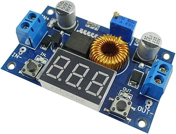
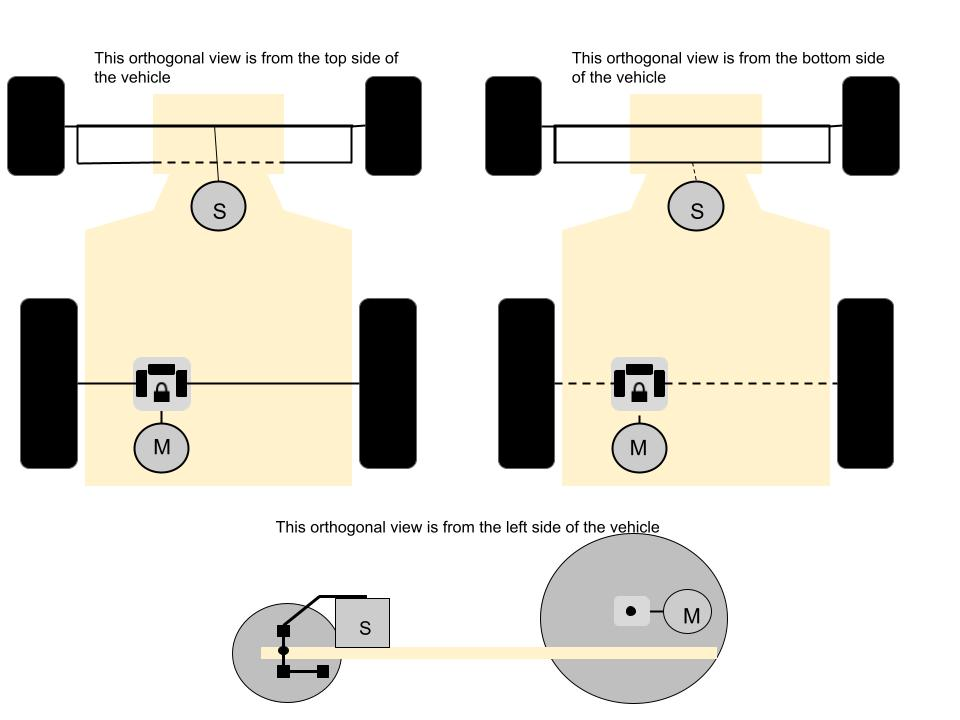
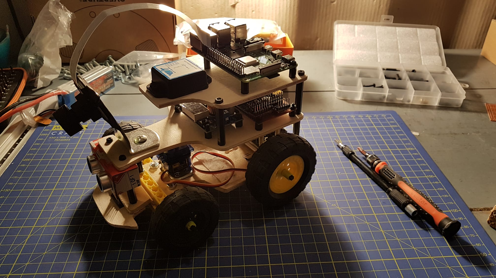

<!-- 

    

        Volterra Team
    

    

        WRO 2024 International Final: Future Engineers
    

 -->

# **Volterra Team**

### **WRO 2024 International Final: Future Engineers**

<i>#This is the official repository of the Team Volterra for the international final of the WRO2024 season.</i>
 

# Contents

  
<b style="font-size: 1.5em;">Hardware Design</b>

  <ul style="font-size: 1.2em;">
    <li><a href="#engineering-factor">Engineering Factor</a></li>
    <li><a href="#mobility-management">Mobility Management</a></li>
    <li><a href="#power-management">Power Management</a></li>
    <li><a href="#sense-management">Sense Management</a></li>
    <li><a href="#wiring-diagram">Wiring Diagram</a></li>
    <li><a href="#mechanical-scheme">Mechanical Scheme</a></li>
    <li><a href="#mechanical-lesson">Mechanical lesson</a></li>
  </ul>

  
<b style="font-size: 1.5em;">Software Design</b>

  <ul style="font-size: 1.2em;">
    <li><a href="#programming-language-libraries-environment-and-architecture">Programming Language, Libraries, Environment, and Architecture</a></li>
    <li><a href="#obstacle-detection">Obstacle detection</a></li>
    <li><a href="#algorithm">Algorithm</a></li>
    <!-- <li><a href="#electrical-parts-protocols-schemes">Electrical Parts Protocols Schemes</a></li> -->
  </ul>

  
<b style="font-size: 1.5em;">Media</b>

  <ul style="font-size: 1.2em;">
    <li><a href="#team">Team</a></li>
    <li><a href="#vehicle">Vehicle</a></li>
    <li><a href="#video">Video</a></li>
    <li><a href="#3d-models-and-graphical-representations">3D Models and Graphical Representations</a></li>
  </ul>

  
<b style="font-size: 1.5em;">Build & Setup</b>

  <ul style="font-size: 1.2em;">
    <li><a href="#how-to-assemble-the-prototype">How to Assemble the Prototype</a></li>
    <li><a href="#how-to-setup-the-software-on-the-raspberry-pi-5">How to Setup the Software</a></li>
    <li><a href="#costs-of-the-components">Costs</a></li>
  </ul>

  
<b style="font-size: 1.5em;">Engineering Journal</b>

  <ul style="font-size: 1.2em;">
    <li><a href="#diary">Diary</a></li>
    <li><a href="#what-we-learned">What We Learned</a></li>
    <li><a href="#gantt-chart">Gantt Chart</a></li>
  </ul>

<!-- 

  
<b style="font-size: 1.5em;">Future Improvements</b>

  <ul style="font-size: 1.2em;">
    <li><a href="#our-ideas">Our ideas</a></li>
  </ul>

 -->

---

  

# Engineering Factor

We took charge of the entire prototype design, from the compact and efficient integration of hardware, electronics, and mechanics to its aesthetic appeal. Our goal was to create a captivating prototype by infusing it with a charming vintage style.

We were responsible for both the development and assembly of the vehicle. It features a structure made of three **plywood** panels positioned horizontally at various elevations: two larger panels form the base and middle layers, while a smaller panel, reduced in size, sits on the top. These layers were meticulously cut from the plywood board with a jigsaw, then carefully smoothed using sandpaper.

For the wheel system, we primarily used **Meccano** and **Lego** parts. To ensure accurate control of the wheel positioning, we implemented the **Ackermann steering system**. This system provides different turning angles for the inner and outer wheels when cornering. We accomplished this by incorporating a **mechanical differential** and gears to connect the motor to the rear wheels.

Engineering also involves <b>problems optimization</b>. We focused on optimizing space by strategically positioning hardware to make the design more space-efficient. Additionally, we ensured that the system is easy to dismantle for maintenance or upgrades. On the software side, we prioritized creating a highly scalable program, structured into modules that interact with each other.

 

# Hardware Design

## Mobility Management

In our project we have selected the following motors:

  <table border="1" cellpadding="10" style="margin: 0 auto;">
    <tr>
      <th>Servomotor</th>
      <th>Encoder Gearmotor</th>
    </tr>
    <tr>
      <td>
        

          
        

      </td>
      <td>
        

          
        

      </td>
    </tr>
    <tr>
      <td>
        <ul>
          <li><strong>Servo motor</strong></li>
          <li>Weight: 12g</li>
          <li>Dimensions: 23 x 11.5 x 24 mm approx</li>
          <li>Stall torque: 1.6 kgf*cm at 4.8V</li>
          <li>Operating speed: 0.12s/60° at 4.8V at no load</li>
          <li>Stall torque: 2.0 kgf*cm at 6.0V</li>
          <li>Operating speed: 0.10s/60° at 6V at no load</li>
          <li>Rotational range: 180°</li>
          <li>Pulse cycle: ca. 20ms</li>
          <li>Pulse width: 500-2400 µs</li>
        </ul>
      </td>
      <td>
        <ul>
          <li><strong>DC 12V Encoder Gearmotor</strong></li>
          <li>Up to 200 RPM (Revolutions per minute)</li>
          <li>Stall torque extrapolation: 21 kgf*cm</li>
          <li>50:1 integrated gearbox</li>
          <li>No load current: 0.2A at 12V</li>
          <li>Stall current: 5.5A at 12V</li>
        </ul>
      </td>
    </tr>
  </table>

 

To properly implement the DC 12V encoder gear motor and servo motor, a motor driver and mechanical differential were selected. The gear motor drives the mechanical differential, distributing movement to the rear wheels. It was chosen for its torque multiplication, crucial for precise control in small spaces, like a playing field. The motor's reduction ratios and integrated gearbox simplify development and offer strong power, high torque, and durability due to its enclosed design.

The servo motor steers the front axle, providing efficient, high-torque performance with precise speed control, ideal for dynamic responses. It uses permanent magnets with low rotor inertia, enhancing speed control and energy efficiency.

A **gearmotor** is an electric motor integrated with a gearbox, designed to deliver high torque at low speeds. Compared to a standard motor, it provides enhanced control, efficiency, and precision, particularly ideal for applications like our prototype, where smooth operation at low speeds is critical.  
A **servo motor** is a rotary actuator that precisely controls angular position, speed, and torque, typically using a feedback mechanism. Servos are ideal for applications requiring precise motion control, such as our prototype's steering. 

> [!NOTE]
> We chose the ES08MA servo over more common options like the SG90 because it offers greater robustness and higher torque, making it capable of handling more demanding tasks. Additionally, its metal gears provide increased durability and reliability under load, essential for ensuring consistent performance in our prototype's operations.

 

## Mechanical lesson

[Here you can find a mechanical and physics explanation that we wrote about the Ackermann Steering System and the role of the mechanical differential. We have also explained their role into robotics](other/mechanical_lesson.md)

> [!WARNING]  
> <table><tr><td>Maintenance is essential to ensure the proper functioning of the vehicle. As illustrated in the image, the axes experience wear and tear due to continuous rotation, gradually degrading over time and turning into fine debris. This process can eventually lead to mechanical failures and impaired performance if not addressed promptly. We strongly recommend periodically replacing the mechanical components to maintain optimal performance. Alternatively, to address the issue more permanently, consider upgrading to metal axes.</td><td></td></tr></table>

<!-- <a href="other/mechanical_lesson.md" style="text-decoration: none;">
  <button style="background-color: #4daafc; color: black; border: none; padding: 10px 20px; font-size: 20px; cursor: pointer; border-radius: 10px; display: flex; align-items: center; gap: 15px;">
    
    Mechanical Lesson
  </button>
</a> -->

 

## Power Management

<table>
  <tr>
    <td></td>
    <td><b>LiPo 3S battery</b> Our vehicle's <b>power source</b> is a high-performance <b>LiPo 3S battery with 1800mAh capacity</b>. It has exceptional high-discharge capacity, with three cells operating at 3.7 volts. The battery weighs 135 grams and measures 34x105x23 mm.</td>
  </tr>
  <tr>
    <td></td>
    <td><b>XT-60 connectors</b> XT-60 connectors are strong, reliable connectors used to connect and disconnect batteries safely. They can handle high currents, up to 60 amps, without overheating. These connectors often work with a voltage stabilizer to provide a steady 5.0V output, making them great for powering devices like a Raspberry Pi through its USB Type-C port.</td>
  </tr>
  <tr>
    <td></td>
    <td><b>Voltage regulator and stabilizer</b> A voltage regulator or DC-DC step-down converter is used to reduce the voltage from a higher level to a stable, lower level, ensuring that sensitive electronics receive the correct power. This type of module efficiently converts excess voltage into a usable form. We employ this piece of hardware in order to provide consistent 5V current to power the Raspberry Pi and Arduino Nano.</td>
  </tr>
  <tr>
    <td></td>
    <td><b>Level Converter</b> The level converter facilitates communication between devices with different operating voltages, like Raspberry (3.3V) with Arduino Nano (5.0V) and distance sensor (5.0V).</td>
  </tr>
</table>

**Power Distribution**   Sensors receive 5.0V from the **Raspberry** (except the color sensor at 3.3V). The **EDGE TPU** gets 2W of power from the Raspberry's USB3.0 at 5V, with a peak current use of 900mA. Arduino Nano receives power directly from the voltage stabilizer and provides 5.0V power to the servo motor.

 

## Sense Management

### Raspberry Pi 5

The Raspberry Pi 5 is our Single Board Computer (SBC), offering a powerful upgrade with a quad-core Cortex-A76 processor running at 2.4 GHz, LPDDR4X RAM, and PCIe support for NVMe SSDs. It features enhanced camera handling with the Picamera2 library, advanced power management for stability, and exceptional multitasking capabilities. Ideal for AI, IoT, robotics, and multimedia applications, the Pi 5 delivers the performance and flexibility.
We decided to <b>level up</b> our project by upgrading the SBC model a the newer one, indeed we swapped from Pi 4 to Pi 5.

[Here we wrote an in-depth comparison table between Raspberry Pi 4 and Raspberry Pi 5](other/comparison_rpi4_md_rpi5.md)

<!-- 

  
Here we wrote an in-depth comparison table between Raspberry Pi 4 and Raspberry Pi 5

  <a href="other/comparison_rpi4_md_rpi5.md" style="text-decoration: none;">
    <button style="background-color: #4daafc; color: black; border: none; padding: 10px 20px; font-size: 20px; cursor: pointer; border-radius: 10px; display: flex; align-items: center; gap: 15px;">
      
      Pi comparison
    </button>
  </a> -->

 

This graph shows the <b>improvements we achieved</b> regarding the processing time of the image:

 
Anyhow, upgrading the board came with some difficulties, here there's a list of the difficulties we met and how to solve the problems arised: 
<ul>
  <li><b>No <i>pigpiod</i> Library Support</b></li>
  <li><b>Camera libraries incompatibility</b></li>
  <li><b>Crashes when Handling Multiple Peripherals</b></li>
</ul>

 

[Here we link our extensive description of the problems and correlated solutions.](other/problem_faced_rpi4_to_rpi5.md)

<!-- 

  
Here we link our extensive description of the problems and correlated solutions.

  <a href="other/problem_faced_rpi4_to_rpi5.md" style="text-decoration: none;">
    <button style="background-color: #4daafc; color: black; border: none; padding: 10px 20px; font-size: 20px; cursor: pointer; border-radius: 10px; display: flex; align-items: center; gap: 15px;">
      
      Problems
    </button>
  </a>

 -->
 

> [!IMPORTANT]
> <table> <tr><td>To ensure the Raspberry Pi 5 operates at its best performance without encountering bottlenecks due to overheating, it is essential to apply a heat dissipator and a fan. These components help maintain optimal operating temperatures by efficiently dissipating heat generated during intensive tasks. Without proper cooling, the Raspberry Pi 5 may throttle its performance to prevent damage from high temperatures, which could lead to slower processing speeds and system instability. By installing these cooling solutions, you ensure that the Pi remains within safe thermal limits, allowing it to perform demanding tasks such as AI processing or image handling without performance degradation.</td><td></td></tr></table>

 

> [!TIP]
> As a further enhancement, we recommend adopting a Single Board Computer (SBC) with an <b>dedicated GPU</b> to fully and seamlessly leverage its hardware capabilities. This would largely improve performances!

 

### Google Coral USB Accelerator, Edge TPU
The Edge TPU is an Application-Specific Integrated Circuit (ASIC) designed by Google to execute machine learning models directly on edge devices with exceptional speed and efficiency. Unlike general-purpose processors, the Edge TPU is specifically optimized for TensorFlow Lite models, making it highly effective for AI tasks such as object detection, image classification, and data inference, while maintaining low power consumption. Its ASIC design allows it to perform billions of operations per second with minimal latency, enabling real-time AI processing directly on the device. In our project, the Edge TPU is vital for achieving reliable and high-speed decision-making, as it offloads demanding computations from the Raspberry Pi's CPU, freeing resources for other critical tasks. This integration not only accelerates performance but also supports advanced AI functionalities, such as obstacle detection, ensuring optimal efficiency and responsiveness in edge computing scenarios.

> [!IMPORTANT]
> With the Raspberry Pi 5, the official AI accelerator HAT can be utilized via the PCIe connector. This addition provides significantly more computing power for AI-related tasks, such as object detection or real-time data processing, and is well-supported within the Raspberry Pi ecosystem, ensuring compatibility and ease of integration.
  

### Sensors and Arduino Nano

<table>
  <tr>
    <td></td>
    <td><b>Color Sensor TCS 34725</b> It can detect red, green, blue, and white light components, with an infrared blocking filter for accurate color measurements. It guides the vehicle's direction based on detecting the orange or blue line. Also, we use its data to keep track of the laps. Powered directly at 3.3V from the Raspberry Pi.</td>
  </tr>
  <tr>
    <td></td>
    <td><b>Ultrasound HC SR04</b> Emits 40kHz pulses and measures flight time in microseconds. Operates at 5.0V. Originally intended for continuous distance measurements, but now only used at the start of the round in order to estimate the position of the vehicle.</td>
  </tr>
  <tr>
    <td></td>
    <td><b>Motor Encoder</b> An electromagnetic device powered at 5.0V, used to calculate the distance traveled by measuring wheel revolutions. Not currently in use due to the decision to simplify the prototype.</td>
  </tr>
  <tr>
    <td></td>
    <td><b>WT901C-TTL (Inertial Measurement Unit)</b> A nine-axis sensor with the MPU 6050 chip, it measures angular velocity with an angle less than 180° on the X-axis and 90° on the Y-axis. Voltage range: 3.3V to 5.0V.</td>
  </tr>
  <tr>
    <td></td>
    <td><b>Camera</b> A high-definition 5-megapixel camera module with a 175° wide-angle lens, used to detect walls, obstacles, and their colors. Connected to the Raspberry Pi via the CSI connector.</td>
  </tr>
  <tr>
    <td></td>
    <td><b>Arduino Nano</b> The Arduino Nano is a small and flexible 5V microcontroller board from the Arduino family, ideal for tasks like controlling PWM (Pulse Width Modulation) signals for motors. It has a 16 MHz ATmega328 chip, providing enough power for many projects. It was originally designed to connect the Raspberry Pi to sensors, but now it takes commands from the Raspberry Pi using UART to control servo motors smoothly and accurately.</td>
  </tr>
</table>

 

> [!TIP]
> Integrating a LiDAR system into the project could be a substantial future improvement. LiDAR (Light Detection and Ranging) offers precise distance measurements and high-resolution mapping of the environment, making it invaluable for tasks such as obstacle detection, navigation, and mapping. In our case, LiDAR could enhance the prototype's ability to detect objects with greater accuracy, improve path planning, and enable more advanced autonomous functionalities, ensuring safer and more efficient operation.

  

## Wiring Diagram

> 

> [!NOTE]
> To create the electrical schematic, we utilized "Fritzing," a free and open-source software designed for circuit design and prototyping. Most of the required components were readily available within Fritzing's extensive library, making it straightforward to place and connect them. For components not available in the library, we manually created them using vector drawing tools, ensuring precise placement of pins on the correct grid. This meticulous approach was essential to maintain the accuracy and functionality of the schematic.

 

> [!TIP]
> As a future improvement, we propose the development of a custom PCB (Printed Circuit Board) to manage the wiring, which would represent a significant advancement for the project. This enhancement would streamline the overall design, reduce clutter, improve reliability by minimizing loose connections, and simplify maintenance and troubleshooting.

 

## Mechanical Scheme

> 

 

> [!TIP]
> We recommend enhancing the mechanical components by using metal pieces or 3D-printed carbon fiber parts. These materials offer superior durability, higher strength-to-weight ratios, and increased resistance to wear and tear compared to standard plastic components. Adopting such materials would improve the prototype's robustness, extend its lifespan, and ensure better performance under demanding conditions.

 

# Software Design

## Programming Language, Libraries, Environment and Architecture

We chose Python as the main programming language for this project because of its simplicity, flexibility, and extensive ecosystem of libraries. It makes tasks like hardware control, image processing, and machine learning straightforward to implement. With a strong community behind it, Python also offers a lot of ready-made solutions for common problems.

 

[Here you can find a table where we clarify what are the main libraries we have employed within the project.](other/library_used.md)

<!-- 

  
Here you can find a table where we clarify what are the main libraries we have employed within the project.

  <a href="other/library_used.md" style="text-decoration: none;">
    <button style="background-color: #4daafc; color: black; border: none; padding: 10px 20px; font-size: 20px; cursor: pointer; border-radius: 10px; display: flex; align-items: center; gap: 15px;">
      
      Libraries
    </button>
  </a>

 -->

 

#### Process Design:

The system employs two separate Python processes to optimize performance and maintain compatibility across libraries:
 

<table>
<tr><td><b>Main Process:</b></td><td>Handles overall system functionality, including GPIO control, image processing, and machine learning tasks. This process uses Python 3.9 for compatibility with the broader set of libraries and the library handling GOOGLE CORAL EDGE TPU.</td></tr>
<tr><td><b>Camera Process:</b></td><td>Dedicated to capturing and streaming frames from the Raspberry Pi camera. It uses Python 3.11 to leverage the latest features and performance optimizations of the Picamera library.</td></tr>
</table>
 

#### Multi process architecture

These two processes communicate through ZMQ IPC, where the camera process streams frames to the main process. This design ensures that the camera operations remain lightweight and isolated, avoiding conflicts or performance bottlenecks caused by incompatible libraries or resource-intensive tasks in the main process. This modular approach improves scalability and allows each process to be optimized independently.
 

#### Why we use python virtual environment (venv)

A Python virtual environment (venv) is a self-contained directory that includes its own Python interpreter and libraries. It allows you to create a clean workspace for your project, ensuring that dependencies are isolated and won't interfere with other projects. This is especially useful when working on multiple projects that require different Python versions or library setups, helping to keep everything compatible and conflict-free.
 

## Obstacle detection

**Object recognition**  
Object recognition is at the core of our program, allowing us to detect and accurately pinpoint obstacles. We developed two ways of detecting the obstacles within the playfield: either by using a deep learning model or by applying color segmentation. The latest version of the control software employs the DL model.
 

**Deep learning based object detection**

<!-- Here we thoroughly explain the implementation of a model, the process of training the model and how to put it into production. -->

[Here we thoroughly explain the implementation of a model, the process of training the model and how to put it into production.](other/deep_learning_model_explanation.md)

<!-- 

  <a href="other/deep_learning_model_explanation.md" style="text-decoration: none;">
    <button style="background-color: #4daafc; color: black; border: none; padding: 10px 20px; font-size: 20px; cursor: pointer; border-radius: 10px; display: flex; align-items: center; gap: 15px;">
      
      Model
    </button>
  </a>

 -->

 

**HSV based object detection**  
For color segmentation, we start by converting the image to HSV format. Next, we generate red and green masks, and then we extract object contours to accurately determine their positions.
 

**Wall recognition**  
To locate the wall, we use a procedure similar to the one used in 'HSV-based object detection' for obstacles. First, the image is converted to HSV format, and then a black mask is created. The main differences are in the specific region of the image we examine and the pixel range values we use. In some cases, instead of identifying precise wall coordinates, we scan sections of the image for pixels matching the wall's appearance. If the pixel count exceeds a certain threshold, we interpret it as a positive "sensor" indication of the position of the wall. To detect wall slopes, we apply the HoughLinesP function to the output of the Canny edge detection on a mask for black-like colors. For the full implementation, please refer to the source code.
  

## Algorithm

 
  
The vehicle's strategy for navigating the obstacle course across all challenges has been broken down into a range of possible scenarios that may arise.
  
To maneuver the autonomous vehicle around obstacles on the path, we begin by identifying the nearest obstacle based on its height and then detect the wall on the right or left. We calculate the optimal trajectory between the obstacle and the wall, which becomes the target point for the vehicle's movement. If the obstacle is identified as a red pillar, the vehicle will bypass it on the right; if it is a green pillar, it will avoid it on the left. Usually the optimal trajectory overlaps with the trajectory adopted in order to move to the middle point in between the obstacle and the wall. Anyhow there are other specific cases: 

- If the robot is off-center in the lane and risks hitting the wall, it searches for available open space and adjusts its position to move towards it.  
  
<table>
<tr><td></td><td>When approaching a block from the inner part of the track, just after a corner, continuing to aim for the midpoint between the obstacle and the wall would cause the robot to veer into the wall. To prevent this, the vehicle shifts outward within the lane, creating enough space to safely bypass the block.</td></tr>
<tr><td></td><td>When approaching an obstacle that is on the outer side of the following lane, the prototype will increase the radius of curvature in order to avoid hitting the obstacle when turning to align itself with the wall.</td></tr>
<tr><th>Other cases which also comprises of trajectory optimization (shorter and smoother path)</th></tr>
<tr><td></td><td></td></tr>
</table>
  
As mentioned earlier, when obstacles are not detected, the prototype avoids wall collisions by positioning itself near the midpoint between the lanes. However, if the autonomous vehicle approaches too close to the wall directly ahead, it will make a sufficient steering adjustment to execute a ninety-degree turn, either clockwise or counterclockwise, to continue its path.
<table>
<tr><th>Here are shown two vehicle's trajectories when there are no obstacles with due captions:</th></tr>
<tr>
<td></td>
<td></td>
</tr>
</table>

 
Other relevant part of the movement algorithm:

- When the vehicle collides with the wall, as detected by analyzing data from the IMU sensor, it initiates a reverse movement to back up and realign itself with the field walls.
- If the vehicle is on the incorrect side of the obstacle (such as being on the left when needing to dodge a red block, or on the right for a green block), it will reverse at an angle to position itself on the correct side for a proper dodge.
    

**Parking**

The prototype's goal is to complete the parking maneuver by guiding the front of the vehicle between the two delineators. This movement stops once the prototype is successfully parked or if there isn't enough information to proceed. Since the prototype may not initially be parallel to the parking space, it will attempt to align itself by combining steering adjustments with reverse movements to achieve the correct orientation.
<table>
<tr><th>Here are shown some parking trajectories with due captions:</th></tr>
<tr>
<td></td>
<td></td>
<td></td>
</tr>
</table>

 

# Setup and Build

## How to setup the software on the Raspberry Pi 5

We suggest the following steps for the software setup. This is our (personal) version of the official software setups and installations guides.

1. **Install and setup OS**

- Download the official SD imager on the Raspberry Pi 5 site
- Flash the microSD with the latest version of the recommended 64-bit OS
- Boot the OS:
  - go to _sudo raspi-config_ -> within the next menu select interfaces and enable: I2C, SERIAL, CAMERA, GPIO.
  - go to settings and set auto-login
  - install the GOOGLE CORAL dependecies, please type into the terminal:
    - _echo "deb https://packages.cloud.google.com/apt coral-edgetpu-stable main" | sudo tee /etc/apt/sources.list.d/coral-edgetpu.list_
    - _curl https://packages.cloud.google.com/apt/doc/apt-key.gpg | sudo apt-key add -_
    - _sudo apt-get update_
    - To install the EDGE TPU runtime type:
      - _sudo apt-get install libedgetpu1-std_
    - Otherwise if you want to install the EDGE TPU runtime with maximum operating frequency type in:
      - _sudo apt-get install libedgetpu1-max_
  - Reboot the Pi

2. **Installing Python3.9 interpreter (Python3.11 is installed by default)**

- Open the terminal and type in:
  - _sudo apt update_
  - _sudo apt upgrade_
  - _sudo apt install build-essential tk-dev libncurses5-dev libncursesw5-dev libreadline6-dev libdb5.3-dev libgdbm-dev libsqlite3-dev libssl-dev libbz2-dev libexpat1-dev liblzma-dev zlib1g-dev libffi-dev_
  - _wget wget https://www.python.org/ftp/python/3.9.1/Python-3.9.1.tgz_
  - _tar -zxvf Python-3.9.1.tgz_
  - _cd Python-3.9.1_
  - _make -j4_
  - _sudo make altinstall_
  - Type _python3.9 –version_ to verify the installation process

3. **Install the required dependencies on Python3.11:**

- Open the terminal and type in:
  - _pip install zmq numpy opencv-python picamera2_

4. **Create the Python3.9 virtual environment and install the necessary dependencies:**

- Open the terminal and type in:
  - \*python3.9 -m venv **VENV-NAME\***
- Now activate the venv, type:
  - _source **VENV-NAME**/bin/activate_
- Install the required dependencies, type into the terminal the following instruction:
- _pip install zmq gpiozero numpy smbus colorama opencv-python tensorflow tflite-runtime python3-pycoral_

5. **We will use Cron job scheduler to start the program on boot:**

- Set the control programme to start at the boot of the SBC
  - Within the terminal type _sudo crontab -e_
  - At the very bottom of the file write:
    - _@reboot source **VENV-NAME**/bin/activate_
    - \*@reboot python **/PATH-TO-THE-MAIN-CONTROL-FILE/\***

 

## How to Assemble the Prototype

For assembling the vehicle prototype, we suggest the following steps:

- Gather the necessary tools, such as a multi-bit screwdriver and a wrench.
- Construct the three platforms by cutting plywood sheets based on the diagram files you can find in the model folder.
- Build the Ackermann steering mechanism using screws, LEGO or Meccano parts, and a servo motor; consult the [mechanical diagrams](schemes) for guidance.
- Connect the gearmotor to the rear wheels using a LEGO mechanical differential, as shown in the [mechanical diagrams](schemes).
- Secure the various components to their designated plywood platforms, either by gluing them or, preferably, using spacers to fasten them more securely and prevent any damage; refer to the [vehicle photos](v-photos).
- Stack the platforms with spacers (or similar components) to keep them stable.
- Link the LiPo 3S battery to the tension regulator and stabilizer, ensuring the proper connection with XT 60 connectors. Rotate the potentiometer on the buck-down to set the voltage of the output current to a steady 5.0V.
- Follow the [electrical schematic](schemes/electrical_scheme.jpg) to properly connect the wires. Ensure that all sensors are connected to both the Raspberry Pi and the power source correctly.
- Connect the 12V encoder gear motor and the servo motor, ensuring that the connections are stable and receiving the correct power.
> [!CAUTION]
> Before connecting the servo to the mechanical system make sure it's calibrated and you know its offset angle; otherwise you could end up forcing a movement out of the range of the joints and mechanics, resulting in both the structure and the hardware being damaged.
> Inspect all connections, secure any loose wires, and make sure all parts are firmly in place. Consider using a voltmeter and ammeter to verify that wire connection are genuine.
- Finally, run a test to confirm the vehicle's proper operation.

  

## Costs of the Components

  
Components

<table>
  <thead>
    <tr>
      <th>Category</th>
      <th>Components</th>
      <th>Total Cost</th>
    </tr>
  </thead>
  <tbody>
    <tr>
      <td>Power Supply</td>
      <td>
        Battery LiPo 3S (€30.00), Tension Stabilizer (€8.00), Cable Connector XT 60 (€2.99)
      </td>
      <td>€40.99</td>
    </tr>
    <tr>
      <td>Motors and Drivers</td>
      <td>
        Gearmotor (€35.89), Motor driver (ln298n) (€5.99), Servomotor (€7.06), Mechanical differential (€5.49)
      </td>
      <td>€54.43</td>
    </tr>
    <tr>
      <td>Sensors</td>
      <td>
        Color Sensor (TCS 34725) (€9.00), Ultrasonic Sensor (HC SR04) (€3.99), IMU (WT901C) (€39.89)
      </td>
      <td>€52.88</td>
    </tr>
    <tr>
      <td>Electronics</td>
      <td>
        Raspberry Pi 5 Model B, 8GB RAM (€89.99), Google Coral EDGE TPU (€98.75), Arduino Nano (€11.99), 
        Level Converter 5V to 3.3V (€2.29)
      </td>
      <td>€203.02</td>
    </tr>
    <tr>
      <td>Mechanical Parts</td>
      <td>
        Tyres, axes, linkages (€15.00), Plywood (€3.50), Jumper wires (€5.00)
      </td>
      <td>€23.50</td>
    </tr>
    <tr>
      <td>Camera</td>
      <td>
        Camera (€35.99)
      </td>
      <td>€35.99</td>
    </tr>
  </tbody>
</table>

 

# Engineering Journal

## Diary

---

#### **Day 1: Preparation and Planning**

  

    
We gathered all necessary tools, including:

    <ul>
      <li>Multi-bit screwdriver</li>
      <li>Wrench</li>
      <li>Spacers, screws, and LEGO/Meccano components</li>
    </ul>
    
Plywood sheets were sourced, and the diagrams from the model folder were reviewed to understand the required dimensions for the platforms. A dedicated workspace was organized to streamline the assembly process.

  

  

    
  

---

#### **Day 2: Platform Construction**

  

    
Using the plywood sheets and diagrams, we:

    <ul>
      <li>Cut three platforms to size.</li>
      <li>Sanded edges to remove roughness.</li>
      <li>Labeled each platform for clarity during later assembly steps.</li>
    </ul>
    
Precision measurements ensured that the platforms would fit seamlessly with the other components.

  

  

    
  

---

#### **Day 3: Steering Mechanism and Rear Wheel Setup**

  

    
Tasks completed:

    <ul>
      <li>Built the Ackermann steering mechanism with LEGO parts, screws, and a servo motor, referencing the mechanical diagrams.</li>
      <li>Connected the gear motor to the rear wheels using a LEGO mechanical differential.</li>
    </ul>
    
Both setups were tested for smooth movement to ensure they function as designed.

  

  

    
  

---

#### **Day 4: Component Mounting**

  

    
We secured the primary components to their designated platforms:

    <ul>
      <li>Ackermann steering mechanism and gear motor were mounted securely.</li>
      <li>The LiPo 3S battery and tension regulator were installed on the middle platform, leaving space for wiring.</li>
      <li>Spacers were used to stabilize all components and prevent vibrations.</li>
    </ul>
  

  

    
  

---

#### **Day 5: Electrical Connections**

  

    
Electrical work included:

    <ul>
      <li>Following the electrical schematic to connect the Raspberry Pi, sensors, and motors to the power source.</li>
      <li>Attaching XT60 connectors to the LiPo battery.</li>
      <li>Adjusting the buck-down potentiometer to stabilize the voltage at 5.0V.</li>
      <li>Verifying voltage levels with a voltmeter for safety and consistency.</li>
    </ul>
  

  

    
  

---

#### **Day 6: Platform Assembly and Inspection**

  

    
Steps taken:

    <ul>
      <li>Stacked the three platforms with spacers for structural stability.</li>
      <li>Conducted a detailed inspection of all connections to confirm security.</li>
      <li>Organized and tied loose wires to avoid interference with moving parts.</li>
      <li>Confirmed stable current flow using an ammeter.</li>
    </ul>
  

  

    
  

---

#### **Day 7: Testing and Debugging**

  

    
A full system test was conducted:

    <ul>
      <li>Evaluated steering, gear motor, and sensors for proper functionality.</li>
      <li>Fine-tuned the servo motor’s alignment.</li>
      <li>Fixed minor wiring issues for enhanced reliability.</li>
    </ul>
    
By the end of the day, the prototype was operational and ready for further trials.

  

  

    
  

---

**Next Steps:** Continue testing in dynamic environments and collect performance data.

## Gantt Chart

