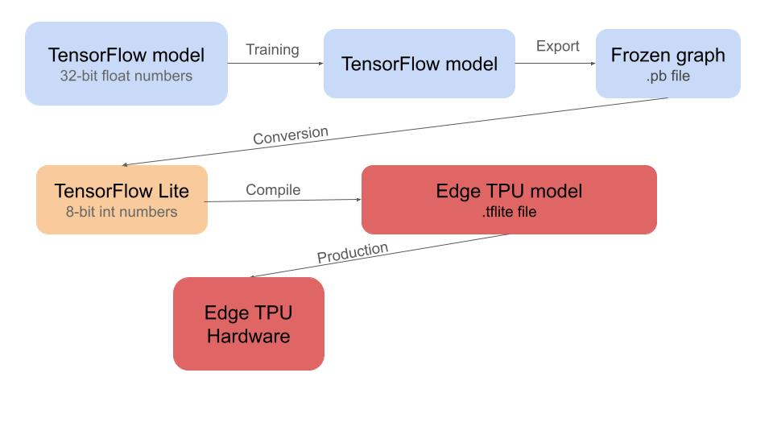

# Obstacle Detection Using Object Detection Model

## Introduction

After several rounds of testing in past competitions, we concluded that using an HSV filter to detect obstacles is not always effective. This is mainly due to the need for constant adjustments under varying light conditions, which often leads to incorrect obstacle recognition. With the introduction of magenta-colored parking obstacles this year, the limitations of HSV filtering have become even more pronounced.

To address these issues, we opted to use an object detection model that can provide fast and accurate results. After testing multiple architectures of YOLO, we ultimately chose the **SSD MobileNet V2 FPNLite** model for its balance between speed and accuracy.

## Dataset and Model Training

The model was trained on a custom dataset comprising approximately 4,000 images of obstacles from the game field. Each image was labeled with the classes "magenta," "red," and "green."

### Model Output

The trained model returns the positions of the obstacles within the image, along with their confidence scores.

## Size Choice and Comparison

We explored various input image sizes to optimize the model's performance without compromising accuracy. Below are the results of our experiments:

### mAP Results

| **Model**     | **Resolution** | **Red** | **Green** | **Magenta** | **Overall** |
| ------------- | -------------- | ------- | --------- | ----------- | ----------- |
| **Quantized** | 128x128        | 39.27%  | 33.92%    | 62.92%      | 45.37%      |
| **Quantized** | 256x256        | 58.72%  | 56.88%    | 79.25%      | 64.95%      |
| **Quantized** | 320x320        | 60.53%  | 54.57%    | 78.59%      | 64.57%      |

Through these tests, we determined that a resolution of 320x320 pixels offers the best trade-off between accuracy and speed.

## Hardware Acceleration

To prevent CPU resource saturation, we employed the **Google Coral USB Accelerator**, enabling high-speed machine learning inference on our Raspberry Pi.

### Model Quantization and Compilation

We quantized our model from `float32` to `int8`, which allowed us to run the model efficiently on the Edge TPU. The following image illustrates the steps involved in the model conversion process:

## Training Environment

We utilized the free version of **Google Colab** to train our model. This approach allowed us to take advantage of GPU acceleration, which is essential for training deep learning models efficiently. The entire training process was conducted using the notebook file provided in our repository.

### Colab Setup

- **Notebook**: Using the button below you can open the Colab Notebook that contains detaledly commented code to train the model, quantize it and convert it to Edge TPU format.
   
  
- **Environment**: The Colab environment provided access to a GPU, which significantly sped up the training process.
- **Model Training**: The model was trained using TensorFlow and required several hours of computation due to the size of the dataset and the complexity of the model.

## Conclusion

By shifting from HSV filters to an object detection model and leveraging the Google Coral USB Accelerator, we achieved significant improvements in both speed and accuracy. The SSD MobileNet V2 FPNLite model, trained on our custom dataset, provides reliable obstacle detection in varying lighting conditions, making it a valuable asset in this year's competition.
