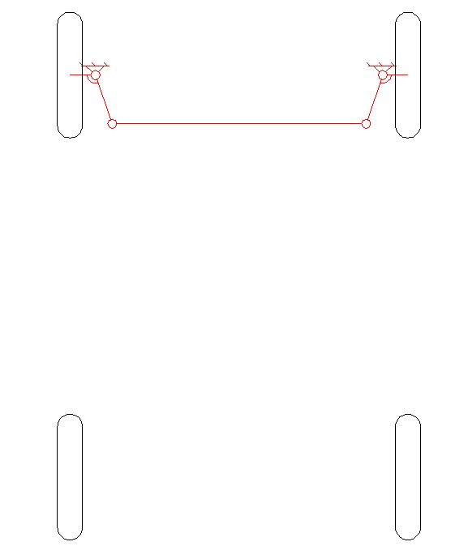

## Theoretical Physics/Engineering/Mechanical Lesson
### Understanding the Ackermann Steering System in Robotics

The Ackermann steering system is a key principle in vehicle dynamics, used in both robotics and automotive engineering to optimize wheel alignment during turns. It ensures that each wheel follows the correct turning radius, reducing tire wear and enhancing stability.

#### Basics of Ackermann Steering

The system's design involves adjusting the angles of the front wheels so that they follow different paths during a turn. The inner wheels turn more sharply than the outer wheels, ensuring all wheels' axes meet at a single turning point. This precise alignment is achieved using a set of steering arms and linkages.
The core idea behind Ackermann steering geometry is that the two front wheels must always point to a common instantaneous center of rotation (ICR) when turning. This center lies on the extension of the rear axle, meaning that each wheel must steer at slightly different angles.
 

 
This is how we can calculate the angles
 
$$\tan(\theta_{\text{in}}) = \frac{L}{R - \frac{W}{2}}$$
 
$$\tan(\theta_{\text{out}}) = \frac{L}{R + \frac{W}{2}}$$
 
Where
- $\theta_{\text{in}}$ is the steering angle of the inner wheel.
- $\theta_{\text{out}}$ is the steering angle of the outer wheel.
- $L$ is the wheelbase (distance between front and rear axles).
- $W$ is the track width (distance between the front wheels).

Let's see an animation that will make everything more clear:
 

#### Application in Robotics

Ackermann steering is widely used in robotic platforms that mimic car-like movement, called Ackermann robots. It enables these robots to navigate smoothly and handle tight turns, making it essential for applications like autonomous vehicles and delivery robots.

#### Role of Differentials

During a turn, the wheels on the outside need to rotate faster than those on the inside. A differential mechanism solves this by allowing each wheel to turn at different speeds while receiving power from the same source. This prevents skidding and ensures controlled motion through turns.

#### Integration in Robotics

In robotics, combining Ackermann steering with differentials improves precision and maneuverability. The steering controls wheel alignment, while the differential manages torque distribution, allowing for smooth, natural movement essential for advanced navigation tasks.
